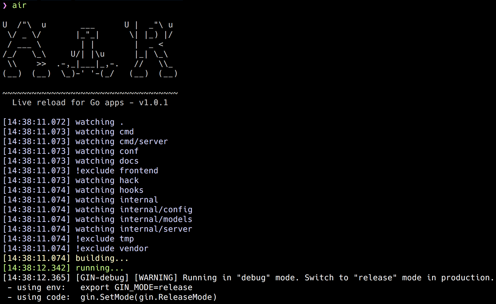

# :cloud: Air - Go アプリケーションのためのライブリロード

[](https://github.com/air-verse/air/releases)
[](https://github.com/air-verse/air/blob/master/go.mod)
[](https://github.com/air-verse/air/releases)
[](https://hub.docker.com/r/cosmtrek/air)
[](https://github.com/air-verse/air/actions?query=workflow%3AGo+branch%3Amaster)
[](https://www.codacy.com/gh/air-verse/air/dashboard?utm_source=github.com&amp;utm_medium=referral&amp;utm_content=air-verse/air&amp;utm_campaign=Badge_Grade)
[](https://codecov.io/gh/air-verse/air)

[English](README.md) | [简体中文](README-zh_cn.md) | [繁體中文](README-zh_tw.md) | 日本語

Air は Go アプリケーション開発用のライブリロードコマンドラインユーティリティです。プロジェクトのルートディレクトリで `air` を実行し、放置し、コードに集中してください。なお、このツールは本番環境へのホットデプロイとは無関係です。



## 目次

- [Air - Go アプリケーションのためのライブリロード](#cloud-air---go-アプリケーションのためのライブリロード)
  - [目次](#目次)
  - [インストール](#インストール)
    - [`go install` を使う場合（推奨）](#go-install-を使う場合推奨)
    - [`go get -tool` を使う場合（プロジェクトへのインストール）](#go-get--tool-を使う場合プロジェクトへのインストール)
    - [`install.sh` を使う場合](#installsh-を使う場合)
    - [goblin.run を使う場合](#goblinrun-を使う場合)
    - [Homebrew を使う場合](#homebrew-を使う場合)
    - [Scoop を使う場合](#scoop-を使う場合)
    - [mise を使う場合](#mise-を使う場合)
    - [Docker/Podman を使う場合](#dockerpodman-を使う場合)
  - [クイックスタート](#クイックスタート)
  - [特徴](#特徴)
  - [使い方](#使い方)
    - [実行時引数](#実行時引数)
    - [デバッグ](#デバッグ)
  - [設定](#設定)
    - [引数から指定された設定を上書き](#引数から指定された設定を上書き)
    - [起動バナー](#起動バナー)
    - [Entrypoint](#entrypoint)
    - [環境変数ファイル](#環境変数ファイル)
    - [プラットフォームごとのビルド設定の上書き](#プラットフォームごとのビルド設定の上書き)
    - [監視ルール: リビルドの代わりにコマンドを実行する](#監視ルール-リビルドの代わりにコマンドを実行する)
    - [プロキシ: ブラウザを自動的にリロードする](#プロキシ-ブラウザを自動的にリロードする)
  - [Docker](#docker)
    - [公式イメージを使う](#公式イメージを使う)
    - [シェル関数](#シェル関数)
    - [Docker Compose](#docker-compose)
    - [air イメージを使わない場合](#air-イメージを使わない場合)
  - [Q&A](#qa)
    - ["command not found: air" または "No such file or directory"](#command-not-found-air-または-no-such-file-or-directory)
    - [bin のパスに ' が含まれる場合の WSL でのエラー](#bin-のパスに--が含まれる場合の-wsl-でのエラー)
    - [ホットコンパイルのみを行い、何も実行しない方法は？](#ホットコンパイルのみを行い何も実行しない方法は)
    - [静的ファイルの変更時にブラウザを自動的にリロードする方法](#静的ファイルの変更時にブラウザを自動的にリロードする方法)
  - [開発](#開発)
    - [リリース](#リリース)
  - [動機](#動機)
  - [スターヒストリー](#スターヒストリー)
  - [スポンサー](#スポンサー)
  - [ライセンス](#ライセンス)

## インストール

### `go install` を使う場合（推奨）

go 1.25 以上が必要です。

```shell
go install github.com/air-verse/air@latest
```

Go の bin ディレクトリが `PATH` に含まれていることを確認してください。

```shell
export PATH="$PATH:$(go env GOPATH)/bin"
```

### `go get -tool` を使う場合（プロジェクトへのインストール）

go 1.25 以上が必要です。

```shell
go get -tool github.com/air-verse/air@latest

# 使い方は以下の通りです:
go tool air -v
```

### `install.sh` を使う場合

```shell
# バイナリは $(go env GOPATH)/bin/air にインストールされます
curl -sSfL https://raw.githubusercontent.com/air-verse/air/master/install.sh | sh -s -- -b $(go env GOPATH)/bin

# または./bin/にインストールすることもできます
curl -sSfL https://raw.githubusercontent.com/air-verse/air/master/install.sh | sh -s

air -v
```

### goblin.run を使う場合

[goblin.run](https://goblin.run) を参照してください。

```shell
# バイナリは /usr/local/bin/air にインストールされます
curl -sSfL https://goblin.run/github.com/air-verse/air | sh

# 任意のパスに配置することもできます
curl -sSfL https://goblin.run/github.com/air-verse/air | PREFIX=/tmp sh
```

### Homebrew を使う場合

```shell
brew install go-air
```

### Scoop を使う場合

```shell
scoop install air
```

### mise を使う場合

```shell
mise use -g air
```

### Docker/Podman を使う場合

[cosmtrek/air](https://hub.docker.com/r/cosmtrek/air) イメージを pull してください。使い方は [Docker](#docker) を参照してください。

## クイックスタート

```shell
# プロジェクトに移動します
cd /path/to/your_project

# カレントディレクトリの `.air.toml` を優先し、見つからない場合はデフォルト値を使います
air
```

編集可能な設定ファイルが必要な場合は、最初に一度 `air init` を実行し、それ以降は `air` を実行するだけです。

```shell
# デフォルト設定で .air.toml を生成します
air init

# .air.toml が自動的に読み込まれます
air
```

特定の設定ファイルを明示的に使う場合は `-c` を指定します。

```shell
air -c .air.toml
```

利用可能な設定項目については [air_example.toml](air_example.toml) を参照してください。

## 特徴

- [x] カラフルなログ出力
- [x] ビルドやその他のコマンドをカスタマイズ
- [x] サブディレクトリを除外することをサポート
- [x] Air 起動後は新しいディレクトリを監視します
- [x] より良いビルドプロセス
- [x] 設定可能な `.env` ファイルの読み込み

## 使い方

### 実行時引数

air コマンドの後に引数を追加することで、ビルドしたバイナリを実行するための引数を渡すことができます。

```shell
# ./tmp/main benchを実行します
air bench

# ./tmp/main server --port 8080を実行します
air server --port 8080
```

air コマンドに渡す引数とビルドしたバイナリに渡す引数は `--` で区切ることができます。

```shell
# ./tmp/main -hを実行します
air -- -h

# カスタム設定で air を実行し、ビルドされたバイナリに -h 引数を渡す
air -c .air.toml -- -h
```

### デバッグ

`air -d`は全てのログを出力します。

## 設定

### 引数から指定された設定を上書き

air の設定フィールドはコマンドライン引数としてサポートされています。利用可能な引数は以下のコマンドで確認できます。

```shell
air -h
# または
air --help
```

もしビルドコマンドと起動コマンドを設定したい場合は、設定ファイルを使わずに以下のようにコマンドを使うことができます。

```shell
air --build.cmd "go build -o bin/api cmd/run.go" --build.entrypoint "./bin/api"
```

入力値としてリストを取る引数には、アイテムを区切るためにコンマを使用します。

```shell
air --build.cmd "go build -o bin/api cmd/run.go" --build.entrypoint "./bin/api" --build.exclude_dir "templates,build"
```

リストを取る引数は繰り返し指定することもでき、値は現れた順に追加されます。コマンドラインをスクリプトや Makefile で生成する場合に便利です。

```shell
# --env_files ".env,.env.local,.env.secret" と同じです
air --env_files ".env,.env.local" --env_files ".env.secret"
```

### 起動バナー

Air が起動時に出力する内容は `misc.startup_banner` で制御できます。

```toml
[misc]
# 未設定（デフォルト）: 組み込みの ASCII バナーとバージョンを表示します。

# 空文字列を設定: 何も出力しません。
startup_banner = ""

# 任意のテキストを設定: 組み込みバナーの代わりにこのテキストを出力します。
# startup_banner = "API watcher"
```

### Entrypoint

`build.entrypoint` では、`build.cmd` が生成したバイナリと、その実行方法を指定します。値は文字列（実行ファイルのみ）でも文字列の配列でも構いません。配列の場合、最初の要素が実行ファイルで（`root` からの相対パスとして解決されます。パス区切り文字を含まない場合は `$PATH` から探されます）、それ以降の要素はすべてデフォルト引数として扱われます。`build.args_bin` とコマンドラインで渡された引数は、これらの引数の後に追加されます。従来の `build.bin` フィールドは非推奨で、今後のリリースで削除される予定です。entrypoint の書き方を使ってください。

```toml
[build]
entrypoint = ["./tmp/main"]
args_bin = ["server", ":8080"]

# デフォルト引数をバイナリの直後にインラインで書くこともできます。
entrypoint = ["./tmp/main", "server", ":8080"]

# パス区切り文字を省くと、dlv のように PATH から解決されます。
entrypoint = [
  "dlv", "exec", "--accept-multiclient", "--log", "--headless", "--continue",
  "--listen=:8999", "--api-version", "2", "./tmp/main",
]
```

### 環境変数ファイル

`env_files` を設定すると、Air はビルド前と実行前に `.env` ファイルから環境変数を自動的に読み込みます。

```toml
# .env.development、続いて .env を読み込みます。
# 後ろのファイルの値が前の値を上書きします。
# air の実行前から存在していた変数は上書きしません。
env_files = [".env.development", ".env"]
```

### プラットフォームごとのビルド設定の上書き

`[build.windows]`、`[build.darwin]`、`[build.linux]` を使うと、OS ごとにビルド設定を上書きできます。これらのブロックは、対応するプラットフォームで実行したときに `[build]` の値を上書きします。プラットフォームブロックでサポートされるのは次のフィールドのみです: `pre_cmd`、`cmd`、`post_cmd`、`bin`、`entrypoint`、`full_bin`、`args_bin`。

```toml
[build]
cmd = "go build -o ./tmp/main ."
bin = "./tmp/main"

[build.windows]
cmd = "go build -o ./tmp/main.exe ."
bin = "tmp\\main.exe"
entrypoint = ["tmp\\main.exe"]
```

現在の OS のデフォルト値が基本設定と異なる場合、`air init` はその OS 向けのプラットフォームブロックを追加します。

### 監視ルール: リビルドの代わりにコマンドを実行する

ファイルの変更に対して、アプリのリビルドではなくコマンドを実行したい場合があります。ディスクから配信するフロントエンドのアセットや、`templ`/`sqlc`/`go generate` のようなパイプラインなどです。そうしたものにはそれぞれ `[[build.rules]]` ブロックを定義します。

```toml
[build]
cmd = "go build -o ./tmp/main ."
# メインのビルドはフロントエンドを無視しますが……
exclude_dir = ["web"]

# ……このルールがそれを監視し、変更時にアセットをリビルドします
[[build.rules]]
name = "assets"
include_dir = ["web"]
include_ext = ["js", "ts", "css"]
cmd = "npm run build"

[[build.rules]]
name = "templ"
include_ext = ["templ"]
cmd = "templ generate"
```

ルールに一致したファイルはそのルールの `cmd` を実行するだけで、メインのビルドの監視条件にも一致する場合であってもリビルドは発生しません。ルールのディレクトリは `exclude_dir` に含まれていても監視されます。ルールのコマンドがメインのビルドの監視対象となるファイルを生成した場合（たとえば `templ generate` が `.go` ファイルを書き出す場合）、リビルドは自然に続いて実行されます。

各ルールは `include_dir`、`include_ext`、`include_file`、`exclude_regex`、そして `delay`（デバウンス、ミリ秒単位、デフォルト 1000）をサポートします。`include_*` のいずれか 1 つは必須です。ルールはコマンドの完了まで待ちます。実行中に届いた変更はキューに入り、完了後にもう一度実行されます。

### プロキシ: ブラウザを自動的にリロードする

Air は Web アプリの前段に小さなプロキシを置くことができます。ビルドが成功するたびにブラウザを更新するので、自分でリロードする必要がなくなります。

```toml
[proxy]
enabled = true
# ブラウザで開くポート
proxy_port = 8090
# アプリが listen しているポート
app_port = 8080
```

いつも通り `air` を起動し、アプリ自身のポートではなく `http://localhost:8090` をブラウザで開きます。リクエストは `app_port` に転送され、Air はすべての HTML レスポンスの `</body>` タグの前に小さなスクリプトを注入します。ビルドが完了すると、そのスクリプトがページをリロードします。

これが動作するには 2 つの条件があります。

- HTML に `</body>` タグが含まれていること。含まれていないとスクリプトを注入する場所がなく、ページはそのまま配信されます。
- 編集するファイルが監視対象であること。静的ファイルは `include_dir`、`include_ext`、`include_file` のいずれかでカバーする必要があります。

アプリの起動が遅く（データベース接続や設定の読み込みなど）、"unable to reach app" というエラーが出る場合は、待ち時間を延ばしてください。

```toml
[proxy]
# ビルド後にアプリへの接続をリトライする時間（ミリ秒、デフォルト 5000）
app_start_timeout = 10000
```

## Docker

### 公式イメージを使う

この Docker イメージを pull してください: [cosmtrek/air](https://hub.docker.com/r/cosmtrek/air)。

```shell
docker/podman run -it --rm \
    -w "<PROJECT>" \
    -e "air_wd=<PROJECT>" \
    -v $(pwd):<PROJECT> \
    -p <PORT>:<APP SERVER PORT> \
    cosmtrek/air \
    -c <CONF>
```

`<PROJECT>` はコンテナ内のプロジェクトのパスです（例: `/go/example`）。コンテナに入りたい場合は `--entrypoint=bash` を追加してください。

私のプロジェクトのひとつは Docker で動作しています。

```shell
docker run -it --rm \
  -w "/go/src/github.com/cosmtrek/hub" \
  -v $(pwd):/go/src/github.com/cosmtrek/hub \
  -p 9090:9090 \
  cosmtrek/air
```

### シェル関数

通常のアプリケーションのように air を継続的に使いたい場合は、`${SHELL}rc`（Bash、Zsh など）に関数を作成できます。

```shell
air() {
  podman/docker run -it --rm \
    -w "$PWD" -v "$PWD":"$PWD" \
    -p "$AIR_PORT":"$AIR_PORT" \
    docker.io/cosmtrek/air "$@"
}
```

`$PWD` は現在のディレクトリに置き換えられ、`$AIR_PORT` は公開するポートを指定し、`$@` は `-c` のようなアプリケーション自体の引数を受け取るためのものです。

```shell
cd /go/src/github.com/cosmtrek/hub
AIR_PORT=8080 air -c "config.toml"
```

### Docker Compose

```yaml
services:
  my-project-with-air:
    image: cosmtrek/air
    # working_dir の値はマップされたボリュームの値と同じでなければなりません
    working_dir: /project-package
    ports:
      - <any>:<any>
    environment:
      - ENV_A=${ENV_A}
      - ENV_B=${ENV_B}
      - ENV_C=${ENV_C}
    volumes:
      - ./project-relative-path/:/project-package/
```

### air イメージを使わない場合

`Dockerfile`

```Dockerfile
# 1.25以上の任意のバージョンを選択してください
FROM golang:1.25-alpine

WORKDIR /app

RUN go install github.com/air-verse/air@latest

COPY go.mod go.sum ./
RUN go mod download

CMD ["air", "-c", ".air.toml"]
```

`docker-compose.yaml`

```yaml
version: "3.8"
services:
  web:
    build:
      context: .
      # Dockerfile へのパスを正してください
      dockerfile: Dockerfile
    ports:
      - 8080:3000
    # ライブリロードのために、コードベースディレクトリを /app ディレクトリにバインド/マウントすることが重要です
    volumes:
      - ./:/app
```

## Q&A

### "command not found: air" または "No such file or directory"

Go の bin ディレクトリが `PATH` に含まれていることを確認してください。

```shell
export GOPATH=$HOME/xxxxx
export PATH=$PATH:$GOROOT/bin:$GOPATH/bin
export PATH=$PATH:$(go env GOPATH)/bin #この設定を .profile で確認し、追加した場合は .profile を source するのを忘れないでください!!!
```

### bin のパスに ' が含まれる場合の WSL でのエラー

bin の `'` をエスケープするには `\` を使用したほうが良いです。関連する issue: [#305](https://github.com/air-verse/air/issues/305)

### ホットコンパイルのみを行い、何も実行しない方法は？

[#365](https://github.com/air-verse/air/issues/365) を参照してください。

```toml
[build]
  cmd = "/usr/bin/true"
```

### 静的ファイルの変更時にブラウザを自動的にリロードする方法

プロキシを有効にしてください。詳しくは[プロキシ: ブラウザを自動的にリロードする](#プロキシ-ブラウザを自動的にリロードする)を参照してください。静的ファイルが `include_dir`、`include_ext`、`include_file` のいずれかでカバーされていることを確認してください。カバーされていないと、変更してもリロードされません。詳細は issue [#512](https://github.com/air-verse/air/issues/512) を参照してください。

## 開発

必要な Go のバージョンは 1.25+ です（`go.mod` を参照）。

```shell
# プロジェクトをフォークしてください

# クローンしてください
mkdir -p $GOPATH/src/github.com/cosmtrek
cd $GOPATH/src/github.com/cosmtrek
git clone git@github.com:<YOUR USERNAME>/air.git

# 依存関係をインストールしてください
cd air
make ci

# コードを探検してコーディングを楽しんでください！
make install
```

プルリクエストを歓迎します。

### リリース

```shell
# master にチェックアウトします
git checkout master

# リリースに必要なバージョンタグを付与します
git tag v1.xx.x

# リモートにプッシュします
git push origin v1.xx.x

# CI が実行され、新しいバージョンがリリースされます。約5分待つと最新バージョンを取得できます
```

## 動機

Go でウェブサイトを開発し始め、[gin](https://github.com/gin-gonic/gin) を使っていた時、gin にはライブリロード機能がないのが残念でした。そこで探し回って [fresh](https://github.com/pilu/fresh) を試してみましたが、あまり柔軟ではないようでした。なので、もっと良いものを書くことにしました。そうして、Air が誕生しました。

加えて、[pilu](https://github.com/pilu) に感謝します。fresh がなければ、Air もありませんでした。:)

## スターヒストリー

<a href="https://www.star-history.com/?type=date&repos=air-verse%2Fair">
 <picture>
   <source media="(prefers-color-scheme: dark)" srcset="https://api.star-history.com/chart?repos=air-verse/air&type=date&theme=dark&legend=top-left&sealed_token=Hco9-oCrW-DEs5NoMXHxhaeqKGxblritR-8yG387lxb5Evvo5YnQgHYwuEbruQQw2s49v9jlKc_uR9aUCOvSwdXBj_kBpR3oHfnuHPK7AgwfI2HAoBlNcA" />
   <source media="(prefers-color-scheme: light)" srcset="https://api.star-history.com/chart?repos=air-verse/air&type=date&legend=top-left&sealed_token=Hco9-oCrW-DEs5NoMXHxhaeqKGxblritR-8yG387lxb5Evvo5YnQgHYwuEbruQQw2s49v9jlKc_uR9aUCOvSwdXBj_kBpR3oHfnuHPK7AgwfI2HAoBlNcA" />
   
 </picture>
</a>

## スポンサー

[](https://www.buymeacoffee.com/cosmtrek)

多くの支援者に心から感謝します。皆さんの親切をいつも覚えています。

## ライセンス

[GNU General Public License v3.0](LICENSE)
