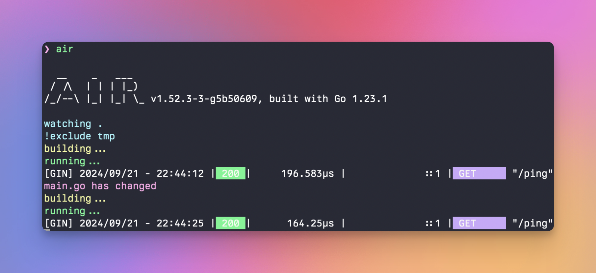

# Air [](https://github.com/air-verse/air/actions?query=workflow%3AGo+branch%3Amaster) [](https://www.codacy.com/gh/air-verse/air/dashboard?utm_source=github.com&utm_medium=referral&utm_content=air-verse/air&utm_campaign=Badge_Grade) [](https://goreportcard.com/report/github.com/air-verse/air) [](https://codecov.io/gh/air-verse/air)

:cloud: 热重载 Go 应用的工具



[English](README.md) | 简体中文 | [繁體中文](README-zh_tw.md)

## 开发动机

当我用 Go 和 [gin](https://github.com/gin-gonic/gin) 框架开发网站时，gin 缺乏实时重载的功能是令人遗憾的。我曾经尝试过 [fresh](https://github.com/pilu/fresh) ，但是它用起来不太灵活，所以我试着用更好的方式来重写它。Air 就这样诞生了。此外，非常感谢 [pilu](https://github.com/pilu)。没有 fresh 就不会有 air :)

Air 是为 Go 应用开发设计的另外一个热重载的命令行工具。只需在你的项目根目录下输入 `air`，然后把它放在一边，专注于你的代码即可。

**注意**：该工具与生产环境的热部署无关。

## 特色

- 彩色的日志输出
- 自定义构建或必要的命令
- 支持外部子目录
- 在 Air 启动之后，允许监听新创建的路径
- 更棒的构建过程

### 使用参数覆盖指定配置

支持使用参数来配置 air 字段:

如果你只是想配置构建命令和运行命令，您可以直接使用以下命令，而无需配置文件:

```shell
air --build.cmd "go build -o bin/api cmd/run.go" --build.bin "./bin/api"
```

对于以列表形式输入的参数，使用逗号来分隔项目:

```shell
air --build.cmd "go build -o bin/api cmd/run.go" --build.bin "./bin/api" --build.exclude_dir "templates,build"
```

## 安装

### 使用 `go install` （推荐）

使用 go 1.23 或更高版本:

```shell
go install github.com/air-verse/air@latest
```

### 使用 install.sh

```shell
# binary 文件会是在 $(go env GOPATH)/bin/air
curl -sSfL https://raw.githubusercontent.com/air-verse/air/master/install.sh | sh -s -- -b $(go env GOPATH)/bin

# 或者把它安装在 ./bin/ 路径下
curl -sSfL https://raw.githubusercontent.com/air-verse/air/master/install.sh | sh -s

air -v
```

### 使用 [goblin.run](https://goblin.run)

```shell
# binary 将会安装到 /usr/local/bin/air
curl -sSfL https://goblin.run/github.com/cosmtrek/air | sh

# 自定义路径安装
curl -sSfL https://goblin.run/github.com/cosmtrek/air | PREFIX=/tmp sh
```

### Docker/Podman

请拉取这个 Docker 镜像 [cosmtrek/air](https://hub.docker.com/r/cosmtrek/air).

```shell
docker run -it --rm \
    -w "<PROJECT>" \
    -e "air_wd=<PROJECT>" \
    -v $(pwd):<PROJECT> \
    -p <PORT>:<APP SERVER PORT> \
    cosmtrek/air
    -c <CONF>
```

#### Docker/Podman .${SHELL}rc

如果你想像正常应用程序一样连续使用 air，你可以在你的 ${SHELL}rc（Bash, Zsh 等）中创建一个函数

```shell
air() {
  podman/docker run -it --rm \
    -w "$PWD" -v "$PWD":"$PWD" \
    -p "$AIR_PORT":"$AIR_PORT" \
    docker.io/cosmtrek/air "$@"
}
```

`<PROJECT>` 是容器中的项目路径，例如：`/go/example`
如果你想进入容器，请添加 `--entrypoint=bash`。

<details>
  <summary>例如</summary>

我的一个项目运行在 Docker 中：

```shell
docker run -it --rm \
  -w "/go/src/github.com/cosmtrek/hub" \
  -v $(pwd):/go/src/github.com/cosmtrek/hub \
  -p 9090:9090 \
  cosmtrek/air
```

另一个例子：

```shell
cd /go/src/github.com/cosmtrek/hub
AIR_PORT=8080 air -c "config.toml"
```

这将用当前目录替换 `$PWD`，`$AIR_PORT` 是要发布的端口，而 `$@` 用于接受应用程序本身的参数，例如 `-c`

</details>

## 使用方法

为了方便输入，您可以添加 `alias air='~/.air'` 到您的 `.bashrc` 或 `.zshrc` 文件中.

首先，进入你的项目文件夹

```shell
cd /path/to/your_project
```

最简单的方法是执行

```shell
# 优先在当前路径查找 `.air.toml` 后缀的文件，如果没有找到，则使用默认的
air -c .air.toml
```

您可以运行以下命令，将具有默认设置的 `.air.toml` 配置文件初始化到当前目录。

```shell
air init
```

在这之后，你只需执行 `air` 命令，无需额外参数，它就能使用 `.air.toml` 文件中的配置了。

```shell
air
```

如欲修改配置信息，请参考 [air_example.toml](air_example.toml) 文件.

### 运行时参数

您可以通过把变量添加在 air 命令之后来传递参数。

```shell
# 会执行 ./tmp/main bench
air bench

# 会执行 ./tmp/main server --port 8080
air server --port 8080
```

你可以使用 `--` 参数分隔传递给 air 命令和已构建二进制文件的参数。

```shell
# 会运行 ./tmp/main -h
air -- -h

# 会使用个性化配置来运行 air，然后把 -h 后的变量和值添加到运行的参数中
air -c .air.toml -- -h
```

### Docker Compose

```yaml
services:
  my-project-with-air:
    image: cosmtrek/air
    # working_dir value has to be the same of mapped volume
    working_dir: /project-package
    ports:
      - <any>:<any>
    environment:
      - ENV_A=${ENV_A}
      - ENV_B=${ENV_B}
      - ENV_C=${ENV_C}
    volumes:
      - ./project-relative-path/:/project-package/
```

### 调试

`air -d` 命令能打印所有日志。

## Docker 用户安装和使用指南（如果不想使用 air 镜像）

`Dockerfile`

```Dockerfile
# 选择你想要的版本，>= 1.16
FROM golang:1.23-alpine

WORKDIR /app

RUN go install github.com/cosmtrek/air@latest

COPY go.mod go.sum ./
RUN go mod download

CMD ["air", "-c", ".air.toml"]
```

`docker-compose.yaml`

```yaml
version: "3.8"
services:
  web:
    build:
      context: .
      # 修改为你的 Dockerfile 路径
      dockerfile: Dockerfile
    ports:
      - 8080:3000
    # 为了实时重载，将代码目录绑定到 /app 目录是很重要的
    volumes:
      - ./:/app
```

## Q&A

### 遇到 "command not found: air" 或 "No such file or directory" 该怎么办？

```shell
export GOPATH=$HOME/xxxxx
export PATH=$PATH:$GOROOT/bin:$GOPATH/bin
export PATH=$PATH:$(go env GOPATH)/bin <---- 请确认这行在您的配置信息中！！！
```

### 在 wsl 下 bin 中包含 ' 时的错误

应该使用 `\` 来转义 bin 中的 `'`。相关问题：[#305](https://github.com/cosmtrek/air/issues/305)

### 问题：如何只进行热编译而不运行？

[#365](https://github.com/cosmtrek/air/issues/365)

```toml
[build]
  cmd = "/usr/bin/true"
```

### 如何在静态文件更改时自动重新加载浏览器?

请参考 [#512](https://github.com/cosmtrek/air/issues/512).

- 确保你的静态文件在 `include_dir`、`include_ext` 或 `include_file` 中。
- 确保你的 HTML 有一个 `</body>` 标签。
- 通过配置以下内容开启代理：

```toml
[proxy]
  enabled = true
  proxy_port = <air proxy port>
  app_port = <your server port>
```

## 开发

请注意：这需要 Go 1.16+ ，因为我使用 `go mod` 来管理依赖。

```shell
# 1. 首先复刻（fork）这个项目

# 2. 其次克隆（clone）它
mkdir -p $GOPATH/src/github.com/cosmtrek
cd $GOPATH/src/github.com/cosmtrek
git clone git@github.com:<YOUR USERNAME>/air.git

# 3. 安装依赖
cd air
make ci

# 4. 这样就可以快乐地探索和玩耍啦！
make install
```

顺便说一句: 欢迎 PR~

### 发布新版本

```shell
# 1. checkout 到 master 分支
git checkout master

# 2. 添加需要发布的版本号
git tag v1.xx.x

# 3. 推送到远程
git push origin v1.xx.x

CI 将处理并发布新版本。等待大约 5 分钟，你就可以获取最新版本了。
```

## Star 历史

[](https://star-history.com/#cosmtrek/air&Date)

## 赞助

[](https://www.buymeacoffee.com/cosmtrek)

非常感谢众多支持者。我一直铭记你们的善意。

## 许可证

[GNU General Public License v3.0](LICENSE)
