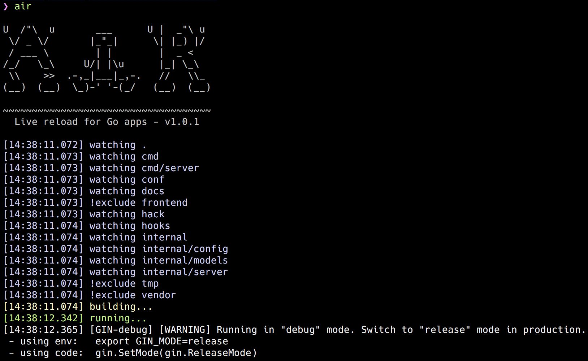

# Air [](https://github.com/cosmtrek/air/actions?query=workflow%3AGo+branch%3Amaster) [](https://www.codacy.com/app/cosmtrek/air?utm_source=github.com&amp;utm_medium=referral&amp;utm_content=cosmtrek/air&amp;utm_campaign=Badge_Grade) [](https://goreportcard.com/report/github.com/cosmtrek/air)

:cloud: Live reload for Go apps



:fire::fire::fire: [JOB HIRING](https://github.com/cosmtrek/air/issues/59)

## Motivation

When I get started with developing websites in Go and [gin](https://github.com/gin-gonic/gin) framework, it's a pity
that gin lacks live-reloading function. In fact, I tried [fresh](https://github.com/pilu/fresh) and it seems not much
flexible, so I intended to rewrite it in a better way. Finally, Air's born.
In addition, great thanks to [pilu](https://github.com/pilu), no fresh, no air :)

Air is yet another live-reloading command line utility for Go applications in development. Just `air` in your project root directory, leave it alone,
and focus on your code.

NOTE: This tool has nothing to do with hot-deploy for production.

## Features

* Colorful log output
* Customize build or binary command
* Support excluding subdirectories
* Allow watching new directories after Air started
* Better building process

## Installation

### Go

The classic way to install

```bash
go get -u github.com/cosmtrek/air
```

### macOS, Linux, Windows

The binary is published on the [release page](https://github.com/cosmtrek/air/releases).

P.S. Great thanks mattn's [PR](https://github.com/cosmtrek/air/pull/1) for supporting Windows platform.

### Docker way

Please pull this docker image [cosmtrek/air](https://hub.docker.com/r/cosmtrek/air).

```bash
docker run -it --rm \
    -w "<PROJECT>" \
    -e "air_wd=<PROJECT>" \
    -v $(pwd):<PROJECT> \
    -p <PORT>:<APP SERVER PORT> \
    cosmtrek/air
    -c <CONF>
```

For example, one of my project runs in docker:

```bash
docker run -it --rm \
    -w "/go/src/github.com/cosmtrek/hub" \
    -v $(pwd):/go/src/github.com/cosmtrek/hub \
    -p 9090:9090 \
    cosmtrek/air
```

## Usage

For less typing, you could add `alias air='~/.air'` to your `.bashrc` or `.zshrc`.

First enter into your project

```bash
cd /path/to/your_project
```

The simplest usage is run

```bash
# firstly find `.air.conf` in current directory, if not found, use defaults
air -c .air.conf
```

While I prefer the second way

```bash
# 1. create a new file
touch .air.conf

# 2. paste `air.conf.example` into this file, and **modify it** to satisfy your needs.

# 3. run air with your config. If file name is `.air.conf`, just run `air`.
air
```

See the complete [air_example.conf](air_example.conf)

### Debug

`air -d` prints all logs.

## Development

Please note that it requires Go 1.13+ since I use `go mod` to manage dependencies.

```bash
# 1. fork this project

# 2. clone it
mkdir -p $GOPATH/src/github.com/cosmtrek
cd $GOPATH/src/github.com/cosmtrek
git clone git@github.com:<YOUR USERNAME>/air.git

# 3. install dependencies
cd air
make ci

# 4. explore it and happy hacking!
make install
```

BTW: Pull requests are welcome~

## Sponsor

<a href="https://www.buymeacoffee.com/36lcNbW" target="_blank"></a>

Huge thanks to the following supporters. I've always been remembering your kindness.

* Peter Aba

## License

[GNU General Public License v3.0](LICENSE)
