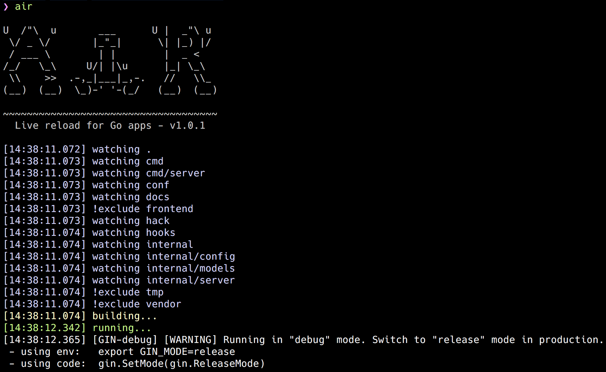

# :cloud: Air - Live reload for Go apps

[](https://github.com/air-verse/air/actions?query=workflow%3AGo+branch%3Amaster) [](https://www.codacy.com/gh/air-verse/air/dashboard?utm_source=github.com&utm_medium=referral&utm_content=air-verse/air&utm_campaign=Badge_Grade) [](https://goreportcard.com/report/github.com/air-verse/air) [](https://codecov.io/gh/air-verse/air)



English | [简体中文](README-zh_cn.md) | [繁體中文](README-zh_tw.md) | [日本語](README-ja.md)

## Motivation

When I started developing websites in Go and using [gin](https://github.com/gin-gonic/gin) framework, it was a pity
that gin lacked a live-reloading function. So I searched around and tried [fresh](https://github.com/pilu/fresh), it seems not much
flexible, so I intended to rewrite it better. Finally, Air's born.
In addition, great thanks to [pilu](https://github.com/pilu), no fresh, no air :)

Air is yet another live-reloading command line utility for developing Go applications. Run `air` in your project root directory, leave it alone,
and focus on your code.

Note: This tool has nothing to do with hot-deploy for production.

## Features

- Colorful log output
- Customize build or any command
- Support excluding subdirectories
- Allow watching new directories after Air started
- Better building process
- Configurable `.env` file loading

### Overwrite specify configuration from arguments

Support air config fields as arguments:

You can view the available command-line arguments by running the following commands:  

```
air -h
```
or  
```
air --help
```

If you want to config build command and run command, you can use like the following command without the config file:

```shell
air --build.cmd "go build -o bin/api cmd/run.go" --build.entrypoint "./bin/api"
```

Use a comma to separate items for arguments that take a list as input:

```shell
air --build.cmd "go build -o bin/api cmd/run.go" --build.entrypoint "./bin/api" --build.exclude_dir "templates,build"
```

## Installation

### Via `go install` (Recommended)

With go 1.25 or higher:

```shell
go install github.com/air-verse/air@latest
```

### Via `go get -tool` (project install)

With go 1.25 or higher:

```shell
go get -tool github.com/air-verse/air@latest

# then use it like so:
go tool air -v
```

### Via install.sh

```shell
# binary will be $(go env GOPATH)/bin/air
curl -sSfL https://raw.githubusercontent.com/air-verse/air/master/install.sh | sh -s -- -b $(go env GOPATH)/bin

# or install it into ./bin/
curl -sSfL https://raw.githubusercontent.com/air-verse/air/master/install.sh | sh -s

air -v
```

### Via [goblin.run](https://goblin.run)

```shell
# binary will be /usr/local/bin/air
curl -sSfL https://goblin.run/github.com/air-verse/air | sh

# to put to a custom path
curl -sSfL https://goblin.run/github.com/air-verse/air | PREFIX=/tmp sh
```

### Via [Homebrew](https://github.com/Homebrew/brew)

```shell
brew install go-air
```

### Via [Scoop](https://scoop.sh)

```shell
scoop install air
```

### Using software package manager [mise](https://github.com/jdx/mise)

```shell
mise use -g air
```

### Docker/Podman

Please pull this Docker image [cosmtrek/air](https://hub.docker.com/r/cosmtrek/air).

```shell
docker/podman run -it --rm \
    -w "<PROJECT>" \
    -e "air_wd=<PROJECT>" \
    -v $(pwd):<PROJECT> \
    -p <PORT>:<APP SERVER PORT> \
    cosmtrek/air
    -c <CONF>
```

#### Docker/Podman .${SHELL}rc

if you want to use air continuously like a normal app, you can create a function in your ${SHELL}rc (Bash, Zsh, etc…)

```shell
air() {
  podman/docker run -it --rm \
    -w "$PWD" -v "$PWD":"$PWD" \
    -p "$AIR_PORT":"$AIR_PORT" \
    docker.io/cosmtrek/air "$@"
}
```

`<PROJECT>` is your project path in container, eg: /go/example
if you want to enter the container, Please add --entrypoint=bash.

<details>
  <summary>For example</summary>

One of my project runs in Docker:

```shell
docker run -it --rm \
  -w "/go/src/github.com/cosmtrek/hub" \
  -v $(pwd):/go/src/github.com/cosmtrek/hub \
  -p 9090:9090 \
  cosmtrek/air
```

Another example:

```shell
cd /go/src/github.com/cosmtrek/hub
AIR_PORT=8080 air -c "config.toml"
```

this will replace `$PWD` with the current directory, `$AIR_PORT` is the port where to publish and `$@` is to accept arguments of the application itself for example -c

</details>

## Usage

If you installed Air with `go install`, make sure your Go bin directory is in your `PATH`:

```shell
export PATH="$PATH:$(go env GOPATH)/bin"
```

First enter into your project

```shell
cd /path/to/your_project
```

The simplest usage is to run

```shell
# first tries `.air.toml` in current directory; if not found, uses defaults
air
```

To use a specific config file explicitly, pass `-c`:

```shell
air -c .air.toml
```

You can initialize the `.air.toml` configuration file to the current directory with the default settings running the following command.

```shell
air init
```

After this, you can just run the `air` command without additional arguments, and it will use the `.air.toml` file for configuration.

```shell
air
```

For modifying the configuration refer to the [air_example.toml](air_example.toml) file.

### Runtime arguments

You can pass arguments for running the built binary by adding them after the air command.

```shell
# Will run ./tmp/main bench
air bench

# Will run ./tmp/main server --port 8080
air server --port 8080
```

You can separate the arguments passed for the air command and the built binary with `--` argument.

```shell
# Will run ./tmp/main -h
air -- -h

# Will run air with custom config and pass -h argument to the built binary
air -c .air.toml -- -h
```

### Startup banner

Use `misc.startup_banner` to control what Air prints at startup.

```toml
[misc]
# Not set (default): show built-in ASCII banner with version.

# Set to empty string: print nothing.
startup_banner = ""

# Set to custom text: print this text instead of the built-in banner.
# startup_banner = "API watcher"
```

### Entrypoint

Use `build.entrypoint` to point at the binary generated by `build.cmd` and describe how it should be executed. The value can be either a string (just the executable) or an array of strings. When using an array, the first element is the executable (resolved relative to `root` unless it lacks a path separator, in which case `$PATH` is consulted) and every subsequent element is treated as a default argument. Values from `build.args_bin` and the command line are appended after the inline arguments. The legacy `build.bin` field is deprecated and will be removed in a future release, so prefer the entrypoint form going forward.

```toml
[build]
entrypoint = ["./tmp/main"]
args_bin = ["server", ":8080"]

# Inline the default arguments directly after the binary.
entrypoint = ["./tmp/main", "server", ":8080"]

# Use PATH-resolved tools like dlv by omitting path separators.
entrypoint = [
  "dlv", "exec", "--accept-multiclient", "--log", "--headless", "--continue",
  "--listen=:8999", "--api-version", "2", "./tmp/main",
]
```

### Environment Files

Air can automatically load environment variables from `.env` files before both building and running when `env_files` is configured.

```toml
# Loads .env.development and then .env files.
# Values in the lattermost file overwrite any preceding ones.
# Does not overwrite variables that were present before running air.
env_files = [".env.development", ".env"]
```


### Platform-specific build overrides

You can override build settings per OS with `[build.windows]`, `[build.darwin]`, and `[build.linux]`. These blocks override the base `[build]` values when running on the matching platform. Only the fields below are supported in platform blocks: `pre_cmd`, `cmd`, `post_cmd`, `bin`, `entrypoint`, `full_bin`, `args_bin`.

```toml
[build]
cmd = "go build -o ./tmp/main ."
bin = "./tmp/main"

[build.windows]
cmd = "go build -o ./tmp/main.exe ."
bin = "tmp\\main.exe"
entrypoint = ["tmp\\main.exe"]
```

Running `air init` adds a platform block for the current OS when its defaults differ from the base configuration.

### Watch rules: run a command instead of rebuilding

Sometimes a change should run a command rather than rebuild your app — frontend assets served from disk, `templ`/`sqlc`/`go generate` pipelines, and so on. Declare a `[[build.rules]]` block for each of them:

```toml
[build]
cmd = "go build -o ./tmp/main ."
# the main build ignores the frontend...
exclude_dir = ["web"]

# ...but this rule watches it and rebuilds the assets on change
[[build.rules]]
name = "assets"
include_dir = ["web"]
include_ext = ["js", "ts", "css"]
cmd = "npm run build"

[[build.rules]]
name = "templ"
include_ext = ["templ"]
cmd = "templ generate"
```

A file matched by a rule runs the rule's `cmd` and never triggers a rebuild, even if it would also match the main build's watch settings. Rule directories are watched even when listed in `exclude_dir`. If a rule's command generates files the main build watches (for example, `templ generate` writing `.go` files), the rebuild follows naturally.

Each rule supports `include_dir`, `include_ext`, `include_file`, `exclude_regex`, and a `delay` (debounce in milliseconds, default 1000). At least one of the `include_*` matchers is required. Rules run their commands to completion; changes arriving meanwhile queue a follow-up run.

### Docker Compose

```yaml
services:
  my-project-with-air:
    image: cosmtrek/air
    # working_dir value has to be the same of mapped volume
    working_dir: /project-package
    ports:
      - <any>:<any>
    environment:
      - ENV_A=${ENV_A}
      - ENV_B=${ENV_B}
      - ENV_C=${ENV_C}
    volumes:
      - ./project-relative-path/:/project-package/
```

### Debug

`air -d` prints all logs.

## Installation and Usage for Docker users who don't want to use air image

`Dockerfile`

```Dockerfile
# Choose whatever you want, version >= 1.25
FROM golang:1.25-alpine

WORKDIR /app

RUN go install github.com/air-verse/air@latest

COPY go.mod go.sum ./
RUN go mod download

CMD ["air", "-c", ".air.toml"]
```

`docker-compose.yaml`

```yaml
version: "3.8"
services:
  web:
    build:
      context: .
      # Correct the path to your Dockerfile
      dockerfile: Dockerfile
    ports:
      - 8080:3000
    # Important to bind/mount your codebase dir to /app dir for live reload
    volumes:
      - ./:/app
```

## Q&A

### "command not found: air" or "No such file or directory"

```shell
export GOPATH=$HOME/xxxxx
export PATH=$PATH:$GOROOT/bin:$GOPATH/bin
export PATH=$PATH:$(go env GOPATH)/bin #Confirm this line in your .profile and make sure to source the .profile if you add it!!!
```

### Error under wsl when ' is included in the bin

Should use `\` to escape the `'` in the bin. related issue: [#305](https://github.com/air-verse/air/issues/305)

### Question: how to do hot compile only and do not run anything?

[#365](https://github.com/air-verse/air/issues/365)

```toml
[build]
  cmd = "/usr/bin/true"
```

### How to Reload the Browser Automatically on Static File Changes

Refer to issue [#512](https://github.com/air-verse/air/issues/512) for additional details.

- Ensure your static files in `include_dir`, `include_ext`, or `include_file`.
- Ensure your HTML has a `</body>` tag
- Activate the proxy by configuring the following config:

```toml
[proxy]
  enabled = true
  proxy_port = <air proxy port>
  app_port = <your server port>
```

## Development

Please note that it requires Go 1.25+ (see `go.mod`).

```shell
# Fork this project

# Clone it
mkdir -p $GOPATH/src/github.com/cosmtrek
cd $GOPATH/src/github.com/cosmtrek
git clone git@github.com:<YOUR USERNAME>/air.git

# Install dependencies
cd air
make ci

# Explore it and happy hacking!
make install
```

Pull requests are welcome.

### Release

```shell
# Checkout to master
git checkout master

# Add the version that needs to be released
git tag v1.xx.x

# Push to remote
git push origin v1.xx.x

# The CI will process and release a new version. Wait about 5 min, and you can fetch the latest version
```

## Star History

<a href="https://www.star-history.com/?type=date&repos=air-verse%2Fair">
 <picture>
   <source media="(prefers-color-scheme: dark)" srcset="https://api.star-history.com/chart?repos=air-verse/air&type=date&theme=dark&legend=top-left&sealed_token=Hco9-oCrW-DEs5NoMXHxhaeqKGxblritR-8yG387lxb5Evvo5YnQgHYwuEbruQQw2s49v9jlKc_uR9aUCOvSwdXBj_kBpR3oHfnuHPK7AgwfI2HAoBlNcA" />
   <source media="(prefers-color-scheme: light)" srcset="https://api.star-history.com/chart?repos=air-verse/air&type=date&legend=top-left&sealed_token=Hco9-oCrW-DEs5NoMXHxhaeqKGxblritR-8yG387lxb5Evvo5YnQgHYwuEbruQQw2s49v9jlKc_uR9aUCOvSwdXBj_kBpR3oHfnuHPK7AgwfI2HAoBlNcA" />
   
 </picture>
</a>

## Sponsor

[](https://www.buymeacoffee.com/cosmtrek)

Give huge thanks to lots of supporters. I've always been remembering your kindness.

## License

[GNU General Public License v3.0](LICENSE)
